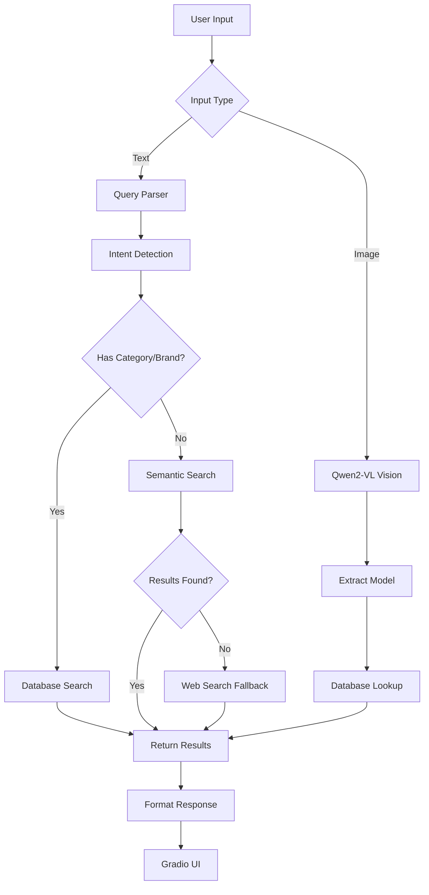

# 🏠 VIVOHOME AI Assistant

<div align="center">


**Multimodal AI Shopping Assistant with Vision-RAG, Intent Detection & Web Search**

[Features](#-features) • [Demo](#-demo) • [Installation](#-installation) • [Usage](#-usage) • [Architecture](#-architecture)

</div>

---

## 🎬 Demo Video

https://github.com/user-attachments/assets/YOUR-VIDEO-ID-HERE

> **📹 Full demo:** Intent Detection • Smart Search • Vision AI • Web Fallback

---

## 📸 Screenshots

### Main Interface


### Key Features

<table>
<tr>
<td width="50%">

**🎯 Intent Detection**

*Compare products across brands*

</td>
<td width="50%">

**📷 Vision AI**

*Extract model from product labels*

</td>
</tr>
<tr>
<td width="50%">

**🌐 Web Search Fallback**

*Search beyond catalog*

</td>
<td width="50%">

**🎨 Modern UI**

*Clean, professional interface*

</td>
</tr>
</table>

---

## 📖 Overview

VIVOHOME AI is an intelligent shopping assistant that combines **Vision-RAG**, **Intent Detection**, and **Web Search** to help customers find products through natural language queries or product images. Built with Qwen2-VL-7B and optimized for production deployment.

### 🎯 Key Capabilities

- **🧠 Intent Detection**: Understands "TV giá cao nhất", "So sánh Samsung và LG"
- **🔍 Smart Search**: Vietnamese-aware semantic + keyword matching
- **📷 Vision-RAG**: Extract model from images → Instant price lookup
- **🌐 Web Fallback**: Searches web when product not in catalog
- **💬 Multimodal Chat**: Text + Image input in one interface

---

## ✨ Features

### 1. Intent-Based Search
```python
Query: "TV giá cao nhất"
→ Intent: highest_price, Category: TV
→ Result: Samsung 75 DU8000 - 19,500,000 VND
```

### 2. Multi-Brand Comparison
```python
Query: "So sánh TV Samsung và LG"
→ Returns: Products from BOTH brands
→ Source: database (structured search)
```

### 3. Vision-RAG Pipeline
```
Image Upload → Qwen2-VL → Extract Model → Database Lookup → Price
Example: Photo of label → "65 DU7700" → 13,000,000 VND
```

### 4. Web Search Fallback
```python
Query: "iPhone 15 Pro Max giá bao nhiêu"
→ Not in catalog → Web search via Tavily API
→ Returns: Latest prices from Vietnamese retailers
```

### 5. Production-Ready
- ✅ Centralized configuration (`app_config.py`)
- ✅ SQLite + ChromaDB (vector search)
- ✅ Comprehensive logging with rotation
- ✅ Type hints across all modules
- ✅ Clean, modern UI (Gradio 6.0)

---

## 🛠️ Tech Stack

| Component | Technology | Purpose |
|-----------|-----------|---------|
| **Vision AI** | Qwen2-VL-7B-AWQ | Image understanding & OCR |
| **Vector Store** | ChromaDB | Semantic search |
| **Web Search** | Tavily API | Out-of-catalog queries |
| **Inference** | vLLM | GPU-optimized serving |
| **Web UI** | Gradio 6.0 | Multimodal chat interface |
| **Database** | SQLite | Product catalog |
| **Intent Parser** | Custom regex | Query understanding |

---

## 📦 Installation

### Prerequisites
- Python 3.10+
- NVIDIA GPU with 15GB+ VRAM (for vLLM)
- CUDA 12.1+

### Quick Start (Lightning AI)

```bash
# 1. Clone repository
git clone https://github.com/nguyencongtuyenlp/vivohome-ai-assistant-.git
cd vivohome-ai-assistant-

# 2. Install dependencies
pip install vllm numpy==1.26.4
pip install -r requirements.txt

# 3. Set environment variables
export TAVILY_API_KEY="your-api-key-here"

# 4. Initialize database
python database.py

# 5. Start vLLM server (Terminal 1)
python -m vllm.entrypoints.openai.api_server \
  --model Qwen/Qwen2-VL-7B-Instruct-AWQ \
  --dtype float16 \
  --max-model-len 4096 \
  --port 8000

# 6. Start Gradio app (Terminal 2)
python app.py
```

---

## 💻 Usage

### Text Queries

```python
# Intent-based queries
"TV giá cao nhất"              # Highest price
"Tủ lạnh rẻ nhất"             # Lowest price
"So sánh TV Samsung và LG"     # Multi-brand comparison

# Category search
"có những loại tivi nào"       # List all TVs
"máy lọc nước có loại nào"    # List water filters

# Brand + product search
"Máy lọc nước Hòa Phát"
"Bình tắm Rossi 15 lít"

# Semantic search
"máy giặt tiết kiệm điện"
"tủ lạnh cho gia đình đông người"

# Web search (out-of-catalog)
"iPhone 15 Pro Max giá bao nhiêu"
"laptop gaming tốt nhất 2024"
```

### Image Queries

1. Click 📎 upload button
2. Select product label image
3. (Optional) Type: "Sản phẩm này giá bao nhiêu?"
4. Get instant price lookup

---

## 🏗️ Architecture



### Data Flow

1. **Input Processing**: Multimodal input (text/image) via Gradio
2. **Intent Detection**: Parse query → extract intent, category, brands
3. **Search Strategy**:
   - **Structured queries** (category/brand/intent) → Database first
   - **Generic queries** → Semantic search → Web fallback if no match
   - **Image queries** → Vision extraction → Model lookup
4. **Response Formatting**: Markdown with emojis + price formatting

---

## 📁 Project Structure

```
vivohome-ai-assistant-/
├── app.py                 # Gradio web interface
├── app_config.py          # Centralized configuration
├── database.py            # SQLite database + search logic
├── query_parser.py        # Intent detection engine
├── rag_engine.py          # RAG pipeline orchestration
├── vector_store.py        # ChromaDB semantic search
├── web_search.py          # Tavily API integration
├── tools.py               # Vision AI utilities
├── logger.py              # Logging with rotation
├── product.csv            # Product catalog
├── requirements.txt       # Python dependencies
├── Dockerfile             # Docker image
├── .env.example           # Environment variables template
├── docs/
│   ├── demo.mp4           # Demo video
│   └── screenshots/       # UI screenshots
└── README.md              # This file
```

---

## 🔧 Configuration

Create `.env` file (see `.env.example`):

```bash
# vLLM Server
VLLM_URL=http://127.0.0.1:8000/v1/chat/completions
VISION_MODEL=Qwen/Qwen2-VL-7B-Instruct-AWQ

# Tavily Web Search
TAVILY_API_KEY=your-api-key-here

# RAG Settings
SIMILARITY_THRESHOLD=0.5
MAX_SEARCH_RESULTS=5

# App Settings
GRADIO_PORT=7860
SHARE_LINK=true
```

---

## 🚧 Roadmap

### Completed ✅
- [x] Vision-RAG pipeline
- [x] Intent-based search
- [x] Semantic search (ChromaDB)
- [x] Web search fallback (Tavily)
- [x] Vietnamese language support
- [x] Modern UI redesign
- [x] Centralized configuration
- [x] Type hints & logging
- [x] Demo video

### Future Enhancements 🔮
- [ ] Multi-language support (English, Chinese)
- [ ] Voice input/output
- [ ] Product recommendation engine
- [ ] Price history tracking
- [ ] Admin dashboard
- [ ] REST API endpoints

---

## 📄 License

This project is licensed under the MIT License.

---

## 🙏 Acknowledgments

- **Qwen Team** for Qwen2-VL-7B model
- **vLLM Team** for efficient inference engine
- **Gradio Team** for amazing UI framework
- **Tavily** for web search API
- **VIVOHOME Electronics** for product data

---

## 📞 Contact

**Developer**: Nguyễn Công Tuyền  
**Email**: nguyencongtuyenlp@gmail.com  
<<<<<<< HEAD
=======
**LinkedIn**: [linkedin.com/in/nguyencongtuyenlp](https://linkedin.com/in/nguyencongtuyenlp)  
>>>>>>> 253f43442f10394bff1f013fed7eea9471939d25
**GitHub**: [@nguyencongtuyenlp](https://github.com/nguyencongtuyenlp)

---

<div align="center">

**⭐ Star this repo if you find it helpful!**

Made with ❤️ for VIVOHOME Electronics

</div>
