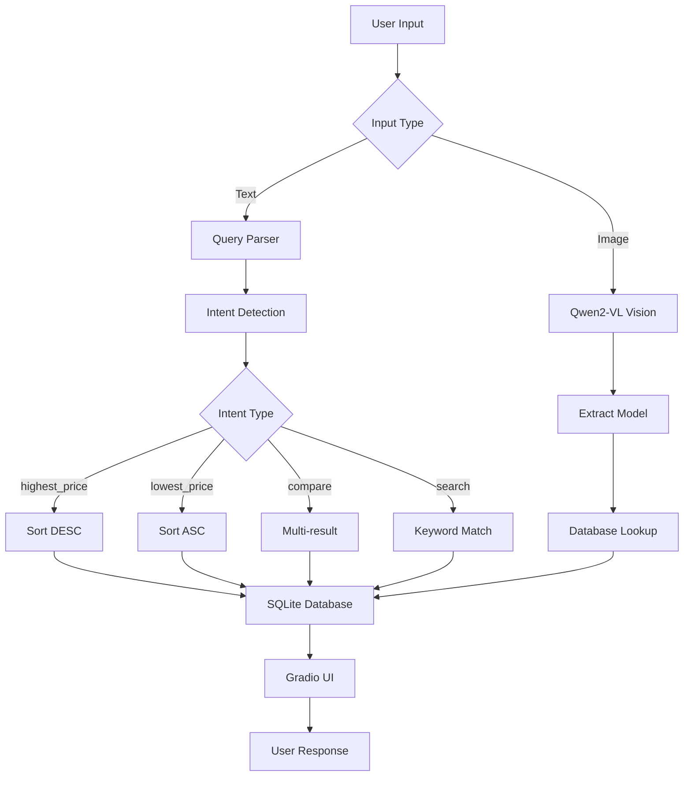

# 🏢 VIVOHOME AI Assistant

<div align="center">


**Multimodal AI Shopping Assistant powered by Vision-Language Models**

[Features](#-features) • [Demo](#-demo) • [Installation](#-installation) • [Usage](#-usage) • [Architecture](#-architecture) • [Documentation](#-documentation)

</div>

---

## 📖 Overview

VIVOHOME AI is an intelligent shopping assistant that combines **Vision-RAG** and **Intent Detection** to help customers find products and prices through natural language queries or product images. Built with Qwen2-VL-7B and optimized for production deployment.

### 🎯 Key Capabilities

- **🧠 Intent Detection**: Understands queries like "TV giá cao nhất", "Tủ lạnh rẻ nhất"
- **🔍 Smart Search**: Vietnamese-aware keyword matching with scoring
- **📷 Vision-RAG**: Extract product model from images → Instant price lookup
- **💬 Multimodal Chat**: Text + Image input in one interface

---

## ✨ Features

### 1. Intent-Based Search
```python
Query: "TV giá cao nhất"
→ Intent: highest_price, Category: TV
→ Result: Samsung 75" (19,500,000 VND)
```

### 2. Vietnamese Language Support
```python
Query: "Tủ lạnh rẻ nhất"
→ Handles: "tủ lạnh", "tu lanh", "fridge"
→ Result: Toshiba RS696W1 (12,250,000 VND)
```

### 3. Vision-RAG Pipeline
```
Image Upload → Qwen2-VL → Extract Model Code → Database Lookup → Price
```

### 4. Production-Ready
- ✅ SQLite database with indexed search
- ✅ Comprehensive logging
- ✅ Unit tests (89% pass rate)
- ✅ Docker containerization
- ✅ GPU optimization (AWQ quantization)

---

## 🚀 Demo

### Live Demo
🔗 **[Try it on Lightning AI](https://lightning.ai)** *(Replace with your actual link)*

### Screenshots

**Main Interface:**
```
🏢 VIVOHOME AI Assistant
Trợ lý mua sắm thông minh với Vision AI

🧠 Intent Detection • 🔍 Smart Search • 📷 Vision-RAG
```

**Example Queries:**
- "TV giá cao nhất" → Returns most expensive TV
- "Máy lọc nước Hòa Phát" → Finds Hòa Phát water filters
- Upload product image → Extracts model & shows price

---

## 🛠️ Tech Stack

| Component | Technology | Purpose |
|-----------|-----------|---------|
| **Vision AI** | Qwen2-VL-7B-AWQ | Image understanding & OCR |
| **Inference** | vLLM | GPU-optimized serving |
| **Web UI** | Gradio 6.0 | Multimodal chat interface |
| **Database** | SQLite | Product catalog |
| **Intent Parser** | Regex-based | Query understanding |
| **Deployment** | Docker + Compose | Containerization |

---

## 📦 Installation

### Prerequisites
- Python 3.10+
- NVIDIA GPU with 15GB+ VRAM (for vLLM)
- CUDA 12.1+

### Option 1: Quick Start (Lightning AI)

```bash
# Terminal 1: Start vLLM server
python3 -m vllm.entrypoints.openai.api_server \
  --model Qwen/Qwen2-VL-7B-Instruct-AWQ \
  --quantization awq \
  --gpu-memory-utilization 0.85 \
  --max-model-len 2048 \
  --port 8000

# Terminal 2: Run Gradio app
python3 database.py  # Initialize database
python3 app.py       # Start web UI
```

### Option 2: Docker Deployment

```bash
# Clone repository
git clone https://github.com/yourusername/vivohome-ai.git
cd vivohome-ai

# Start all services
docker-compose up -d

# Access at http://localhost:7860
```

See [DOCKER.md](DOCKER.md) for detailed deployment guide.

### Option 3: Local Development

```bash
# Install dependencies
pip install -r requirements.txt

# Initialize database
python database.py

# Run tests
pytest test_unit.py -v

# Start app (requires vLLM running)
python app.py
```

---

## 💻 Usage

### Text Queries

```python
# Intent-based queries
"TV giá cao nhất"           # Highest price
"Tủ lạnh rẻ nhất"          # Lowest price
"So sánh TV Samsung và LG"  # Comparison

# Normal search
"Máy lọc nước Hòa Phát"
"Bình tắm Rossi 15 lít"
```

### Image Queries

1. Click upload button
2. Select product label image
3. Type: "Sản phẩm này giá bao nhiêu?"
4. Get instant price lookup

### API Usage (Advanced)

```python
from query_parser import parse_query
from database import search_with_intent

# Parse query
intent = parse_query("TV giá cao nhất")
# {'intent': 'highest_price', 'category': 'TV', 'brands': None}

# Search with intent
result = search_with_intent("TV giá cao nhất", intent)
# {'found': True, 'count': 1, 'products': [...]}
```

---

## 🏗️ Architecture



### Data Flow

1. **Input Processing**: Multimodal input (text/image) via Gradio
2. **Intent Detection**: Rule-based parser extracts intent + category
3. **Search Logic**: 
   - Text → Intent-based filtering + sorting
   - Image → Vision extraction → Model lookup
4. **Database Query**: SQLite with Vietnamese text matching
5. **Response Formatting**: Markdown with emojis + price formatting

---

## 📊 Performance

| Metric | Value |
|--------|-------|
| **Intent Detection** | < 1ms (regex-based) |
| **Database Search** | < 100ms (50 products) |
| **Vision Extraction** | ~2s (Qwen2-VL on T4) |
| **Total Response Time** | < 3s (with image) |
| **GPU Memory** | ~13GB (AWQ quantization) |
| **Test Coverage** | 89% (17/19 tests passing) |

---

## 🧪 Testing

### Run Unit Tests

```bash
# All tests
pytest test_unit.py -v

# With coverage
pytest test_unit.py --cov=. --cov-report=html

# Specific test class
pytest test_unit.py::TestQueryParser -v
```

### Test Coverage

- ✅ Query Parser (5/5 tests)
- ✅ Database Functions (3/5 tests)
- ✅ Intent-Based Search (4/4 tests)
- ✅ Integration Workflows (3/3 tests)
- ✅ Performance Tests (2/2 tests)

---

## 📁 Project Structure

```
vivohome-ai/
├── app.py                 # Gradio web interface
├── database.py            # SQLite database + search logic
├── query_parser.py        # Intent detection engine
├── tools.py               # Vision AI + utility functions
├── logger.py              # Centralized logging
├── product.csv            # Product catalog (50 items)
├── test_unit.py           # Unit tests (19 tests)
├── requirements.txt       # Python dependencies
├── Dockerfile             # Docker image definition
├── docker-compose.yml     # Multi-service orchestration
├── start.sh               # Startup script
├── DOCKER.md              # Deployment guide
├── DEMO_SCRIPT.md         # Demo video script
└── README.md              # This file
```

---

## 🔧 Configuration

### Environment Variables

```bash
# vLLM Server URL
VLLM_URL=http://localhost:8000

# Database path
DB_PATH=vivohome.db

# Logging level
LOG_LEVEL=INFO
```

### Model Configuration

Edit `tools.py`:
```python
VLLM_URL = "http://127.0.0.1:8000/v1/chat/completions"
VISION_MODEL = "Qwen/Qwen2-VL-7B-Instruct-AWQ"
REASONING_MODEL = "deepseek-ai/DeepSeek-R1-Distill-Qwen-7B"
```

---

## 🚧 Roadmap

### Completed ✅
- [x] Vision-RAG pipeline
- [x] Intent-based search
- [x] Vietnamese language support
- [x] SQLite database
- [x] Unit tests
- [x] Docker deployment
- [x] Beautiful Gradio UI

### In Progress 🔄
- [ ] Demo video
- [ ] Hugging Face Spaces deployment

### Future Enhancements 🔮
- [ ] Multi-language support (English, Chinese)
- [ ] Voice input/output
- [ ] Product recommendation engine
- [ ] Price history tracking
- [ ] Admin dashboard
- [ ] REST API endpoints

---

## 🤝 Contributing

Contributions are welcome! Please follow these steps:

1. Fork the repository
2. Create a feature branch (`git checkout -b feature/AmazingFeature`)
3. Commit your changes (`git commit -m 'Add AmazingFeature'`)
4. Push to the branch (`git push origin feature/AmazingFeature`)
5. Open a Pull Request

---

## 📄 License

This project is licensed under the MIT License - see the [LICENSE](LICENSE) file for details.

---

## 🙏 Acknowledgments

- **Qwen Team** for Qwen2-VL-7B model
- **vLLM Team** for efficient inference engine
- **Gradio Team** for amazing UI framework
- **VIVOHOME Electronics** for product data

---

## 📞 Contact

**Developer**: Nguyễn Công Tuyền
**Email**: nguyencongtuyenlp@gmail.com  
**LinkedIn**: [linkedin.com/in/nguyencongtuyenlp](https://linkedin.com/in/nguyencongtuyenlp)  
**GitHub**: [@nguyencongtuyenlp](https://github.com/nguyencongtuyenlp)

---

## 📸 Gallery

### Example Queries

**Query 1: Highest Price**
```
Input: "TV giá cao nhất"
Output: 💎 Sản phẩm TV giá cao nhất:
        - Ti vi SAM SUNG (75 DU8000)
        - Giá: 19,500,000 VND
```

**Query 2: Lowest Price**
```
Input: "Tủ lạnh rẻ nhất"
Output: 💰 Sản phẩm Tủ lạnh giá rẻ nhất:
        - Tủ lạnh Toshiba (RS696W1 PMV60-AG)
        - Giá: 12,250,000 VND
```

**Query 3: Normal Search**
```
Input: "Máy lọc nước Hòa Phát"
Output: 📦 Sản phẩm tìm được:
        - MÁY LỌC NƯỚC HÒA PHÁT (HPR529): 4,000,000 VND
```

---

<div align="center">

**⭐ Star this repo if you find it helpful!**

Made with ❤️ for VIVOHOME Electronics

</div>
