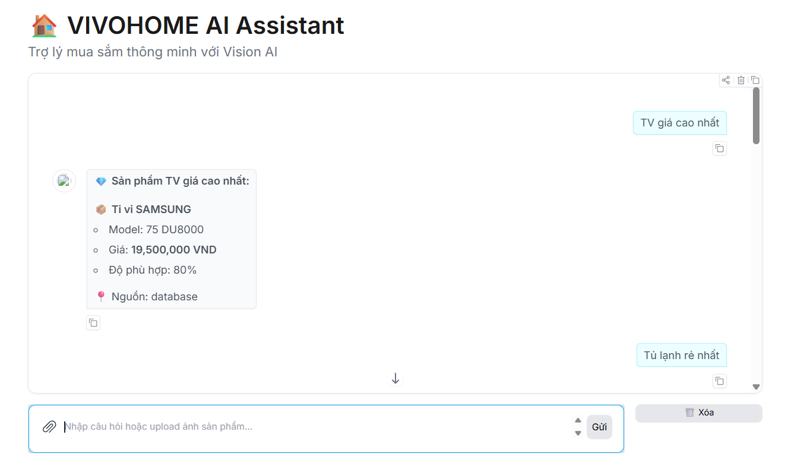
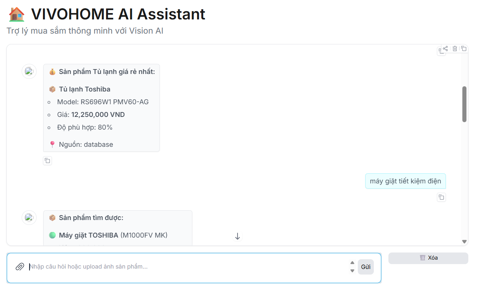
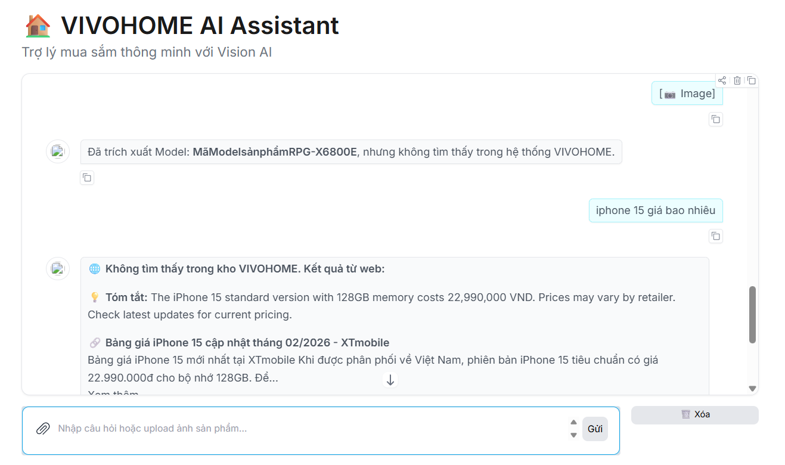
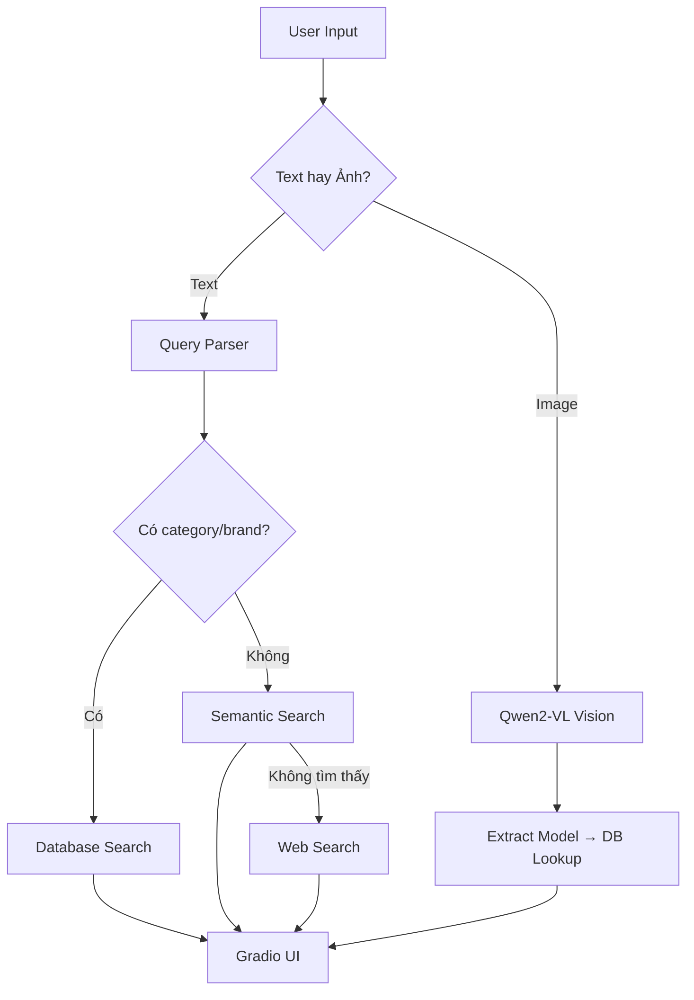

# 🏠 VIVOHOME AI Assistant

<div align="center">


**Trợ lý mua sắm thông minh với Vision AI, RAG Pipeline và Web Search**

</div>

---

## 🎬 Demo

<div align="center">

https://github.com/user-attachments/assets/REPLACE-WITH-YOUR-VIDEO-ID

</div>

> Xem video demo đầy đủ các tính năng: Intent Detection, Smart Search, Vision AI, Web Fallback

---

## 📸 Screenshots

| Intent Detection | Smart Search | Web Search Fallback |
|:---:|:---:|:---:|
|  |  |  |
| *Tìm TV giá cao nhất* | *So sánh Samsung vs LG* | *Tìm iPhone qua web* |

---

## ✨ Tính năng chính

| Tính năng | Mô tả |
|-----------|-------|
| 🧠 **Intent Detection** | Hiểu ý định: giá cao nhất, rẻ nhất, so sánh |
| 🔍 **Smart Search** | Tìm theo category, brand, semantic |
| 📷 **Vision AI** | Upload ảnh tem nhãn → trích xuất model → tra giá |
| 🌐 **Web Fallback** | Sản phẩm không có trong kho → tìm trên web |
| 💬 **Multimodal Chat** | Hỗ trợ text + ảnh trong 1 giao diện |

---

## 🛠️ Tech Stack

| Component | Technology |
|-----------|-----------|
| Vision-Language Model | Qwen2-VL-7B-Instruct-AWQ |
| LLM Inference | vLLM |
| Vector Store | ChromaDB |
| Web Search | Tavily API |
| Database | SQLite |
| Web UI | Gradio 6.0 |

---

## 🏗️ Architecture



---

## 📦 Cài đặt

### Yêu cầu
- Python 3.10+
- NVIDIA GPU ≥ 15GB VRAM
- CUDA 12.1+

### Chạy trên Lightning AI

```bash
# 1. Clone repo
git clone https://github.com/nguyencongtuyenlp/vivohome-ai-assistant-.git
cd vivohome-ai-assistant-

# 2. Cài dependencies
pip install vllm numpy==1.26.4
pip install -r requirements.txt

# 3. Set API key
export TAVILY_API_KEY="your-api-key"

# 4. Build database
python database.py

# 5. Start vLLM (Terminal 1)
python -m vllm.entrypoints.openai.api_server \
    --model Qwen/Qwen2-VL-7B-Instruct-AWQ \
    --dtype float16 \
    --max-model-len 4096 \
    --port 8000

# 6. Start app (Terminal 2)
python app.py
```

---

## 💻 Cách dùng

```python
# Intent-based
"TV giá cao nhất"              → Samsung 75 DU8000 - 19,500,000 VND
"Tủ lạnh rẻ nhất"             → Toshiba RS696W1 - 12,250,000 VND
"So sánh TV Samsung và LG"     → Cả 2 hãng

# Category / Brand search
"có những loại tivi nào"       → Danh sách tất cả TV
"Máy lọc nước Hòa Phát"       → Đúng sản phẩm Hòa Phát

# Semantic search
"máy giặt tiết kiệm điện"     → Máy giặt phù hợp nhất

# Web fallback
"iPhone 15 Pro Max giá bao nhiêu"  → Kết quả từ web

# Vision AI
Upload ảnh tem nhãn → Trích xuất model → Tra giá
```

---

## 📁 Cấu trúc dự án

```
├── app.py              # Gradio UI
├── app_config.py       # Cấu hình tập trung
├── rag_engine.py       # RAG pipeline
├── database.py         # SQLite + search
├── vector_store.py     # ChromaDB semantic search
├── query_parser.py     # Intent detection
├── tools.py            # Vision AI
├── web_search.py       # Tavily API
├── logger.py           # Logging
├── product.csv         # Catalog sản phẩm
├── requirements.txt    # Dependencies
├── Dockerfile          # Docker
├── .env.example        # Template biến môi trường
└── docs/
    ├── demo.mp4
    └── screenshots/
```

---

## 🔧 Cấu hình

Tạo file `.env` (xem `.env.example`):

```bash
VLLM_URL=http://127.0.0.1:8000/v1/chat/completions
VISION_MODEL=Qwen/Qwen2-VL-7B-Instruct-AWQ
TAVILY_API_KEY=your-api-key
SIMILARITY_THRESHOLD=0.5
GRADIO_PORT=7860
```

---

## 📞 Liên hệ

**Nguyễn Công Tuyền**  
📧 nguyencongtuyenlp@gmail.com  
🔗 [GitHub](https://github.com/nguyencongtuyenlp)

---

<div align="center">

⭐ **Star nếu thấy hữu ích!**

Made with ❤️ for VIVOHOME Electronics

</div>
